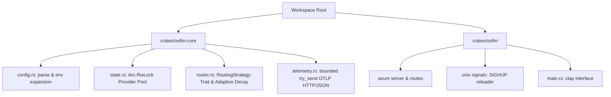

# Finalized Technical Implementation Plan - `oxllm` (Oxide LLM Proxy)

`oxllm` is a minimalist, ultra-low-footprint adaptive routing LLM gateway written in Rust. It exposes an OpenAI-compatible interface, proxying requests to a tiered fallback pool of free-tier LLM providers with automatic rate-limit detection, circuit breakers, signal-based configuration reloading, and lightweight asynchronous OTel metrics/traces.

---

## 1. Architectural Decisions & Production Refinements

Based on our interactive design alignment and expert reviews, we have locked down the following production-grade technical refinements:

1. **TOML Native Configurations (Security & Stability)**:
   * We will use the native `toml` crate instead of the deprecated `serde_yaml` (or vulnerability-prone `serde_yml`). TOML supports clean inline comments, plays natively with Cargo, and avoids unsafe parsing landscapes.
   * `config.toml` will act as the single source of truth for providers, virtual models, and endpoints.
2. **Backpressure-Safe Telemetry (OOM Prevention)**:
   * To prevent memory leaks or kernel panics in memory-constrained environments (like OpenWrt), telemetry will use a **bounded channel** (`tokio::sync::mpsc::channel(1024)`) and a non-blocking `try_send` strategy.
   * If the `otelite` collector is down, the buffer will gracefully drop metrics/traces rather than caching infinitely in RAM.
3. **Axum 0.8 Dependency & Route Syntax**:
   * Axum 0.8 heavily feature-gates common core elements. We will explicitly opt-in to needed features:
     ```toml
     axum = { version = "0.8", features = ["http1", "json", "matched-path"] }
     ```
   * Routes will strictly use Axum 0.8's new explicit token path matching syntax (e.g., `{param}` instead of legacy `:param`).
4. **Adaptive Circuit Breaker with Strict `HalfOpen` (Thundering Herd Defense)**:
   * To prevent thundering herds of concurrent requests from multiplying failure counts and permanently locking up a cooled-down provider, we enforce a strict `HalfOpen` state with a single-concurrent-probe lock.
   * The `probe_in_flight` flag is represented as an `Arc<AtomicBool>` inside `ProviderState`.
   * When selecting a `HalfOpen` provider, we perform a lock-free atomic `compare_exchange` (from `false` to `true` with `Ordering::SeqCst`) under a fast `RwLock::read` lock. This allows other concurrent requests to instantly bypass the provider and cascade to the fallback pool without holding a write lock during the long HTTP call!
5. **Standard OTel Integration & W3C Trace Propagation**:
   * Telemetry uses standard `opentelemetry` (`0.28`), `opentelemetry_sdk` (`0.28`), and `opentelemetry-otlp` (`0.28`) crates with the `http-json` and `reqwest-rustls` features.
   * **W3C Trace Context Propagation**: We will extract incoming `traceparent` headers, participate as a middle/child span in the trace chain, and inject W3C Trace Context headers into upstream requests to the selected provider.
   * **Root Context Generation**: If the incoming request has no active `traceparent`, `oxllm` generates a valid root trace context before forwarding to `otelite` to maintain absolute continuous tracking.
6. **Connection & Handshake Timeouts**:
   * We will enforce a configurable `upstream_timeout_secs` (defaulting to 5 seconds) in `config.toml`. If a provider takes longer than this to connect or complete its handshake, it is treated as a `5xx` connection error, triggering immediate failover.
7. **Security for Administrative Routes**:
   * Administrative endpoints (like `/status` and `/health`) are **localhost-restricted (127.0.0.1)**. External network callers receive an immediate `403 Forbidden` response.
8. **Explicit Hot-Reloading via `tokio::sync::watch`**:
   * The hot-reloading mechanism is pinned explicitly to `tokio::sync::watch`. The Axum server holds a `watch::Receiver<AppState>` to borrow state with negligible (< 2 ms) overhead, and the Unix `SIGHUP` listener holds the `watch::Sender` to safely swap the pointer during runtime.
9. **Graceful Shutdown & Mid-Stream Failure Penalty**:
   * We will handle `SIGTERM` and `SIGINT` signals, integrating with Axum 0.8's graceful shutdown lifecycle to drain in-flight SSE streams before exiting.
   * If a token stream fails mid-flight, we gracefully close the downstream connection, increment `consecutive_failures` by 1, but do **not** attempt to dynamically hot-swap providers mid-flight.
10. **Reqwest Pool Timeout & Non-Standard 429 Failback**:
    * **Reqwest Idle Timeout**: Set `.pool_idle_timeout(Duration::from_secs(90))` on the `reqwest::Client` builder to prevent dead sockets from cluttering the system state.
    * **Non-Standard 429 Failback**: If a `429` arrives without readable headers (like some free-tier proxies that return error JSON blocks), default cleanly to a **30-second backoff**.
11. **Axum 0.8 Streaming Gotchas & Fixes**:
    * **Stream Error Conversion**: `reqwest::Response::bytes_stream()` yields `Result<Bytes, reqwest::Error>`. Axum 0.8's `Body::from_stream` expects `Result<Bytes, Box<dyn std::error::Error + Send + Sync>>`. We must explicitly map errors using `StreamExt::map_err` from `futures-util`.
    * **Header Map Cross-Over**: To avoid dependency conflicts between Axum's and reqwest's re-exported `http::HeaderMap` types, we will explicitly iterate over upstream headers, converting names and values cleanly via bytes before injecting them into downstream Axum responses.
12. **Aggressive Compiler Options (Musl Edge Footprints)**:
    * Standard stripped release parameters added directly to the workspace `Cargo.toml` to enforce a tight binary footprint (<15MB) across `musl` cross-compilation targets.
13. **Cargo Workspace Structure**:
    * **`crates/oxllm-core`**: Core logic, TOML config parser with native Unix `${VAR}` env expansion, `RoutingStrategy` trait, `AdaptivePriorityStrategy`, and telemetry worker.
    * **`crates/oxllm`**: CLI binary, Axum web routing, and `SIGHUP` POSIX signal handling.

---

## 2. Proposed Changes & Crate Structure



### Files to Create

#### [NEW] [Cargo.toml](file:///Users/jonesn/src/oxllm/Cargo.toml)
Declares the workspace members, dependency mapping, and optimized release flags.
```toml
[workspace]
resolver = "2"
members = [
    "crates/oxllm",
    "crates/oxllm-core",
]

[workspace.package]
version = "0.1.0"
edition = "2021"
rust-version = "1.85.1"
authors = ["Nigel Jones"]
license = "Apache-2.0"
repository = "https://github.com/planetf1/oxllm"
homepage = "https://github.com/planetf1/oxllm"

[workspace.dependencies]
tokio = { version = "1", features = ["full"] }
serde = { version = "1", features = ["derive"] }
serde_json = "1"
toml = "0.8"
reqwest = { version = "0.12", default-features = false, features = ["json", "stream", "rustls-tls"] }
bytes = "1"
thiserror = "2"
tracing = "0.1"
tracing-subscriber = { version = "0.3", features = ["env-filter", "json"] }
clap = { version = "4", features = ["derive", "env"] }
axum = { version = "0.8", features = ["http1", "json", "matched-path"] }
time = { version = "0.3", features = ["formatting", "parsing"] }
tokio-stream = "0.1"
futures-util = "0.3"
hex = "0.4"
opentelemetry = { version = "0.28", features = ["trace", "metrics"] }
opentelemetry_sdk = { version = "0.28", features = ["trace", "metrics", "rt-tokio"] }
opentelemetry-otlp = { version = "0.28", default-features = false, features = ["http-json", "reqwest-rustls"] }
opentelemetry-semantic-conventions = "0.28"

[profile.release]
opt-level = "z"      # Optimize specifically for binary size
lto = "fat"          # Enable Fat Link-Time Optimization
codegen-units = 1    # Maximize compiler optimizations
panic = "abort"      # Strip stack unwinding code
strip = true         # Automatically strip symbols and debug info

[profile.dist]
inherits = "release"
lto = "thin"
```

#### [NEW] [rustfmt.toml](file:///Users/jonesn/src/oxllm/rustfmt.toml)
Enforces formatting standards identical to your other projects:
```toml
edition                     = "2021"
max_width                   = 100
tab_spaces                  = 4
hard_tabs                   = false
reorder_imports             = true
reorder_modules             = true
use_field_init_shorthand    = true
use_try_shorthand           = true
merge_derives               = true
remove_nested_parens        = true
match_block_trailing_comma  = true
newline_style               = "Unix"
```

#### [NEW] [dist-workspace.toml](file:///Users/jonesn/src/oxllm/dist-workspace.toml)
Declares Homebrew distribution setups:
```toml
[workspace]
members = ["cargo:."]

[dist]
cargo-dist-version = "0.32.0"
ci = "github"
installers = ["shell", "homebrew"]
targets = ["aarch64-apple-darwin", "aarch64-unknown-linux-gnu", "x86_64-apple-darwin", "x86_64-unknown-linux-gnu"]
tap = "planetf1/homebrew-tap"
publish-jobs = ["homebrew"]
pr-run-mode = "plan"
install-updater = false
allow-dirty = ["ci"]
```

#### [NEW] [crates/oxllm-core/Cargo.toml](file:///Users/jonesn/src/oxllm/crates/oxllm-core/Cargo.toml)
Declares dependencies for core library components.
```toml
[package]
name = "oxllm-core"
version.workspace = true
edition.workspace = true
rust-version.workspace = true
authors.workspace = true
license.workspace = true
repository.workspace = true
homepage.workspace = true
description = "Core adaptive routing engine and telemetry worker for oxllm"

[dependencies]
tokio = { workspace = true }
serde = { workspace = true }
serde_json = { workspace = true }
toml = { workspace = true }
reqwest = { workspace = true }
thiserror = { workspace = true }
tracing = { workspace = true }
time = { workspace = true }
hex = { workspace = true }
opentelemetry = { workspace = true }
opentelemetry_sdk = { workspace = true }
opentelemetry-otlp = { workspace = true }
opentelemetry-semantic-conventions = { workspace = true }
```

#### [NEW] [crates/oxllm-core/src/lib.rs](file:///Users/jonesn/src/oxllm/crates/oxllm-core/src/lib.rs)
Exposes modules for the workspace.

#### [NEW] [crates/oxllm-core/src/error.rs](file:///Users/jonesn/src/oxllm/crates/oxllm-core/src/error.rs)
Defines a robust, public `OxllmError` enum mapping all core domain, parsing, and routing errors.

#### [NEW] [crates/oxllm-core/src/config.rs](file:///Users/jonesn/src/oxllm/crates/oxllm-core/src/config.rs)
Declares the configuration types and performs shell-style `${VAR}` expansion natively.

#### [NEW] [crates/oxllm-core/src/router.rs](file:///Users/jonesn/src/oxllm/crates/oxllm-core/src/router.rs)
Defines the `RoutingStrategy` trait, `AdaptivePriorityStrategy` (including `HalfOpen` probe-locking logic), and logic for penalty decay and backoffs.

#### [NEW] [crates/oxllm-core/src/state.rs](file:///Users/jonesn/src/oxllm/crates/oxllm-core/src/state.rs)
Implements the shared concurrent in-memory `AppState` wrapper protecting the active provider states behind async locks.

#### [NEW] [crates/oxllm-core/src/telemetry.rs](file:///Users/jonesn/src/oxllm/crates/oxllm-core/src/telemetry.rs)
Implements the non-blocking standard OTel batch span processor and telemetry pipeline, backed by bounded channel drops under OOM pressure.

#### [NEW] [crates/oxllm/Cargo.toml](file:///Users/jonesn/src/oxllm/crates/oxllm/Cargo.toml)
Exposes HTTP dependencies (Axum) and lists `oxllm-core` as an internal dependency.
```toml
[package]
name = "oxllm"
version.workspace = true
edition.workspace = true
rust-version.workspace = true
authors.workspace = true
license.workspace = true
repository.workspace = true
homepage.workspace = true
description = "Minimalist adaptive routing LLM proxy in Rust"

[dependencies]
oxllm-core = { path = "../oxllm-core", version = "0.1.0" }
tokio = { workspace = true }
serde = { workspace = true }
serde_json = { workspace = true }
tracing = { workspace = true }
tracing-subscriber = { workspace = true }
clap = { workspace = true }
axum = { workspace = true }
bytes = { workspace = true }
tokio-stream = { workspace = true }
futures-util = { workspace = true }

[dev-dependencies]
pretty_assertions = "1"
```

#### [NEW] [crates/oxllm/src/main.rs](file:///Users/jonesn/src/oxllm/crates/oxllm/src/main.rs)
Initializes CLI flag parsers, reads the initial config, spawns the telemetry background thread, registers the SIGHUP unix reload listener (utilizing `tokio::sync::watch`), and binds the Axum listener.

#### [NEW] [crates/oxllm/src/routes.rs](file:///Users/jonesn/src/oxllm/crates/oxllm/src/routes.rs)
Defines Axum endpoints: `/v1/models`, `/v1/embeddings`, and `/v1/chat/completions` (supporting SSE chunk-streaming via `bytes_stream()` wrapped in Axum's `Sse` and `tokio_stream` mappings), utilizing `{param}` syntax.

---

## 3. Detailed Execution Phases

* **Phase 1: Project & Workspace Layout**
  Create root workspace `Cargo.toml`, `rustfmt.toml`, `dist-workspace.toml`, and the basic sub-directories. Set up stripped release flags for binary size optimizations (<15MB).
* **Phase 2: Configuration, Errors & Env Expansion**
  Implement the standard `OxllmError` types. Implement parsing for `config.toml` supporting shell `${VAR}` expansions.
* **Phase 3: State, Virtual Models & Adaptive Router Trait**
  Implement the `RoutingStrategy` trait and `AdaptivePriorityStrategy`. Incorporate `HalfOpen` states, `probe_in_flight` `AtomicBool` locks to defend against thundering herds, exponential backoffs, and idle-based decay aging. Add virtual model target list expansion.
* **Phase 4: Non-Blocking Telemetry Ingest**
  Build the standard OTel metrics and tracing exporter using `opentelemetry-otlp` with `http-json` and `reqwest-rustls`, backed by a bounded `mpsc` queue and non-blocking `try_send` drops for backpressure safety.
* **Phase 5: Axum Server & Streaming Engine**
  Implement HTTP endpoints, reactive error retries for embeddings, and byte-stream forwarding for SSE chat completions.
* **Phase 6: Unix Signals & Graceful Shutdown**
  Wire in SIGHUP configuration hot-swaps using `tokio::sync::watch`. Set up SIGINT/SIGTERM handlers to gracefully drain open SSE streams.

---

## 4. Verification Plan & Definition of Done

### Automated Verification
* Unit tests in `oxllm-core` for:
  * Unix `${VAR}` replacements.
  * Adaptive decay state-transitions.
  * Virtual models mapping.
  * Lock-free `AtomicBool` permits during `HalfOpen` states.
* Performance tests inside `crates/oxllm-core/benches/` or `crates/oxllm-core/tests/` asserting the `< 2 ms` routing loop overhead under mock candidate environments.
* Integration tests inside a dedicated directory `crates/oxllm/tests/` utilizing mock upstreams to assert:
  * Successful retry loops on rate limits.
  * SSE event stream forwarding behavior.

### Definition of Done Checklist
- [ ] `cargo clippy --workspace --all-targets` returns 0 warnings.
- [ ] The project compiles successfully against the `x86_64-unknown-linux-musl` target.
- [ ] Binary size for `target/release/oxllm` is confirmed under 15 MB after running `strip`.
- [ ] Telemetry `try_send` drops events gracefully without allocating heap memory when the mock endpoint is forced offline.
- [ ] `cargo fmt --check` passes with zero formatting issues.
